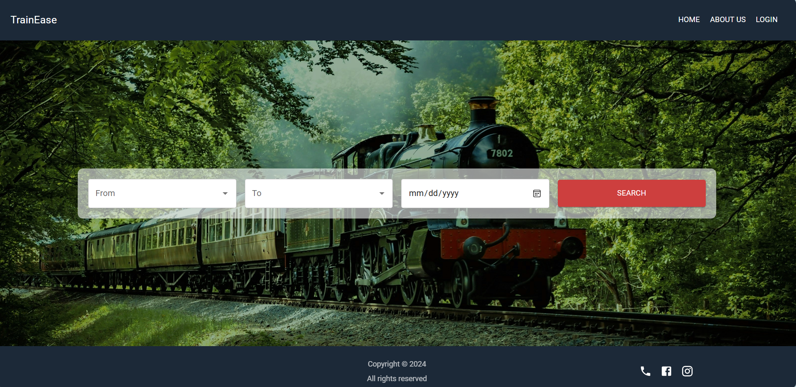

# TrainEase - Train Booking Web Application

TrainEase is a user-friendly web application that simplifies train travel. It allows users to effortlessly search for trains, book tickets, and manage their profiles. With customizable options for class and seat selection, TrainEase ensures a comfortable journey. Real-time notifications keep users informed about booking confirmations, cancellations, and shedule updates, providing a smooth and reliable travel experience.


<div style="display: flex; flex-wrap: wrap; justify-content: space-around;">
    
</div>

## Features

- **User Authentication:** Provides secure login and registration, along with password recovery via email for easy account access. 
  

- **Ticket Booking:** Allows users to select their starting point, destination, and travel date, displaying available trains for easy selection.
  

- **Class and Seat Selection:** Users can choose their preferred travel class (First, Second, Third) and view an interactive seat layout showing available and booked seats.
  

- **Payment Processing:** Offers secure payment processing via Stripe API ensuring users receive e-ticket confirmations via email after successful transactions.
  
- **Profile Management:** Enables users to edit and manage their personal profile details for a personalized experience.
  

- **Booking History:** Allows users to access and review past bookings for easy reference and planning.

- **Booking Cancellations:** Provides the option to cancel bookings before the travel date, ensuring flexibility for users.

- **Real-Time Notifications:** Sends timely updates regarding booking confirmations, cancellations, and schedule changes to keep users informed.
  

- **Logout Option:** Allows users to securely sign out, protecting their personal data and account information.
  

## Tech Stack

- **Frontend:** 
  - [React](https://reactjs.org/) - A JavaScript library for building user interfaces.
  - [Vite](https://vitejs.dev/) - A build tool that improves development experience and performance.

- **Backend:** 
  - [Node.js](https://nodejs.org/) - JavaScript runtime built on Chrome's V8 JavaScript engine.
  - [Express](https://expressjs.com/) - A minimal and flexible Node.js web application framework.

- **Database:** 
  - [MongoDB](https://www.mongodb.com/) - A NoSQL database for flexible document storage.

- **State Management:** 
  - [Redux](https://redux.js.org/) - A predictable state container for JavaScript apps.


## Prerequisites

- **Node.js:** [Download Node.js](https://nodejs.org/) and install it on your machine.
- **npm:** Node Package Manager (npm) is included with Node.js.
- **MongoDB:** Ensure you have MongoDB is installed and running.

## Installation
1. Clone the repository

    ```bash
   git clone https://github.com/DimalshaMadushani/TrainEase-Frontend-Web.git

   cd TrainEase-Frontend-Web
2. Install the dependencies

    ```bash
    yarn install
    OR
   npm install
3. Create an .env file to store environment variables

    ```bash
   VITE_HOST="your-ipv4-address"
   VITE_EMAIL_VALIDATION_API_KEY="5cdac20be06e417397bd927015ae8448"
   VITE_STRIPE_PUBLIC_KEY="pk_test_51Q8k6WIqn2MGjXIL8XDtenhDIaTCstp6lNwrY1qtyU79fcmeKcyxvzI7CUKz3ge4CLakDeuXEYo5QuUmIXkmn9FO00xPqC56kW"

4. Start the development server

    ```
    npm run dev
    ```


## Testing

We use Cypress for User Interface testing. You can run tests using

```
npx cypress open
```

## Deployment

We built our web application on [Render](https://render.com/) plaform. You can access the live application at [TrainEase](https://trainease-frontend-web.onrender.com).

<!-- ```
eas build --platform ios/android
``` -->
<!-- ## Contribution

Contributions are welcome! If you find a bug or want to suggest a feature, feel free to open an issue or submit a pull request. -->

